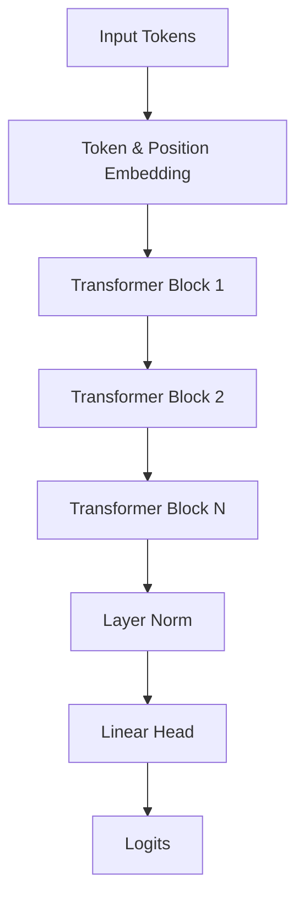

# 🧠 Micro Transformer: NumPy-Only Story Generator


A lean, efficient, and pedagogical implementation of a Generative Pre-trained Transformer (GPT) built entirely using **NumPy**. This project demonstrates the core mechanics of modern LLMs without the overhead of heavy deep learning frameworks.

---

## ✨ Features

- **Pure NumPy Implementation**: Every component from the AdamW optimizer to the Multi-Head Attention is built from scratch.
- **Micro-GPT Architecture**: Implements causal self-attention, layer normalization, and residual connections.
- **Story Generation Mode**: Optimized for generating short stories from character-level patterns.
- **CSV Data Integration**: Seamlessly trains on structured `prompt/completion` datasets.
- **Lightweight & Fast**: Designed to run efficiently on standard CPU hardware.

## 🏗️ Architecture

The model follows the standard decoder-only Transformer architectural pattern:



### Technical Specs (Current Config)
- **Embedding Dimension**: 192
- **Attention Heads**: 6
- **Transformer Layers**: 4
- **Context Window (Block Size)**: 128
- **Optimizer**: AdamW with linear learning rate decay

---

## 🚀 Getting Started

### 1. Prerequisites
Ensure you have Python and NumPy installed:
```bash
pip install numpy
```

### 2. Training the Model
Prepare your data in `data/train_data.csv` and run:
```bash
python train.py
```
This will train the model, save the weights to `model_weights.npz`, and the vocabulary to `vocab.json`.

### 3. Generating Stories
After training, use the test script to generate creative content:
```bash
python test_model.py
```

---

## 🛠️ Project Structure

- 📁 `src/`
  - `model.py`: Core Transformer & Multi-Head Attention logic.
  - `components.py`: Base NN layers (Linear, ReLU, LayerNorm, etc.).
  - `tokenizer.py`: Character-level tokenizer.
  - `optimizer.py`: Custom AdamW implementation.
  - `utils.py`: Loss functions and generation sampling.
- `train.py`: Primary training loop and hyperparameter configuration.
- `test_model.py`: Performance evaluation and story generation.

---

## 📈 Performance & Tuning

To increase accuracy or output length, adjust the following parameters in `train.py`:

- `max_iters`: Increase for better convergence (e.g., `5000+`).
- `block_size`: Increase for longer context memory.
- `n_embd` / `n_layers`: Increase for higher model capacity.

> [!TIP]
> Since this is a NumPy-only CPU implementation, increasing `n_layers` significantly impacts training speed. The current defaults provide a sweet spot for reasonably fast training on most laptops.

---

## 📜 License
This project is open-source and intended for educational purposes. Happy training! 🚀
